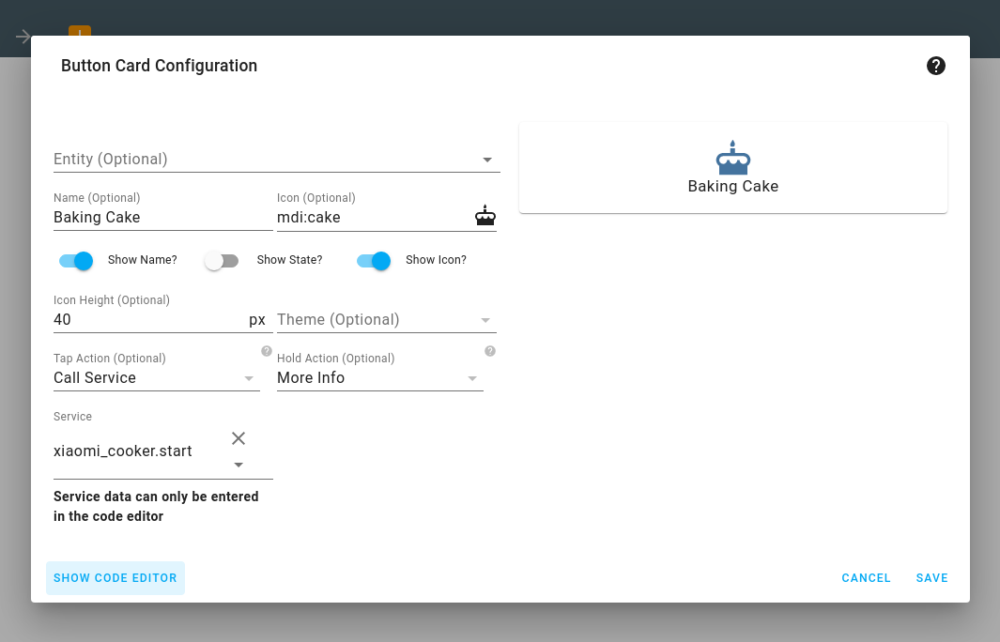

# Xiaomi Mi Electric Rice Cooker

This is a custom component for home assistant to integrate the Xiaomi Mi Electric Rice Cooker V2.

Please follow the instructions on [Retrieving the Access Token](https://home-assistant.io/components/xiaomi/#retrieving-the-access-token) to get the API token to use in the configuration.yaml file.

Credits: Thanks to [Rytilahti](https://github.com/rytilahti/python-miio) for all the work.

## Features

### Rice Cooker V2

* Start cooking a profile
* Stop cooking
* Sensors
  - mode
  - menu
  - temperature
  - remaining
  - duration
  - favorite
  - state (available while cooking)
  - rice_id (available while cooking)
  - taste (available while cooking)
  - taste_phase (available while cooking)
  - stage_name (available while cooking)
  - stage_description (available while cooking)
* Switches
  - TODO: Start/Stop is possible if a default profile is available (Recipe input_select?)
  - TODO: Buzzer on/off
  - TODO: Turn off the backlight on idle
* Chart
  - TODO: Temperature History (Like the temperature chart of the weather forecast)
* Services
  - TODO: stop_outdated_firmware
  - TODO: set_no_warnings / set_acknowledge
  - TODO: set_interaction
  - TODO: set_menu
  - TODO: get_temperature_history


## Install

You can install this custom component by adding this repository ([https://github.com/syssi/xiaomi_cooker](https://github.com/syssi/xiaomi_cooker/)) to [HACS](https://hacs.xyz/) in the settings menu of HACS first. You will find the custom component in the integration menu afterwards, look for 'Xiaomi Mi Electric Rice Cooker Integration'. Alternatively, you can install it manually by copying the custom_component folder to your Home Assistant configuration folder.


## Setup

```yaml
# configuration.yaml

xiaomi_miio_cooker:
  name: Xiaomi Rice Cooker
  host: 192.168.130.88
  token: b7c4a758c251955d2c24b1d9e41ce47d
  model: chunmi.cooker.normal2

# template switch example to start a specific cooking profile
switch:
  - platform: template
    switches:
      - xiaomi_miio_cooker:
        value_template: "{{ is_state('sensor.xiaomi_miio_cooker_mode', 'Running') }}"
        turn_on:
          service: xiaomi_miio_cooker.start
          data:
            profile: "0001E10100000000000080026E10082B126E1412698CAA555555550014280A6E0C02050506050505055A14040A0C0C0D00040505060A0F086E6E20000C0A5A28036468686A0004040500000000000000010202020204040506070708001212180C1E2D2D37000000000000000000000099A5"
        turn_off:
          service: xiaomi_miio_cooker.stop
```

Configuration variables:
- **host** (*Required*): The IP of your cooker.
- **token** (*Required*): The API token of your cooker.
- **name** (*Optional*): The name of your cooker.
- **model** (*Optional*): The model of your device. Valid values are `chunmi.cooker.normal2` and `chunmi.cooker.normal5`. This setting can be used to bypass the device model detection and is recommended if your device isn't always available.

If you prefer a button instead of a switch entity you could add a lovelace button card to you dashboard:

```
type: button
tap_action:
  action: call-service
  service: xiaomi_cooker.start
  service_data:
    profile: "010088003201000028000012000000000000000000000846822A6E14002018000F6E82736E140A201810000000000000000000003C8782716E1400200A100000000000000000000000000000000000000000000000000000000000003C0A000000008700000000000000000000000000424D"
hold_action:
  action: more-info
show_icon: true
show_name: true
icon: 'mdi:cake'
name: Baking Cake
icon_height: 40px
```



## Platform services

#### Service `xiaomi_miio_cooker.start`

Start cooking a profile.

| Service data attribute    | Optional | Description                                                          |
|---------------------------|----------|----------------------------------------------------------------------|
| `profile`                 |       no | Profile data which describes the temperature curve.                  |

Some cooking profile examples: https://raw.githubusercontent.com/rytilahti/python-miio/master/miio/data/cooker_profiles.json

- `MODEL_PRESSURE`: `chunmi.cooker.press1`, `chunmi.cooker.press2`
- `MODEL_NORMAL_GROUP1`: `chunmi.cooker.normal2`, `chunmi.cooker.normal5`
- `MODEL_NORMAL_GROUP2`: `chunmi.cooker.normal3`, `chunmi.cooker.normal4`

#### Service `xiaomi_miio_cooker.stop`

Stop the cooking process.
